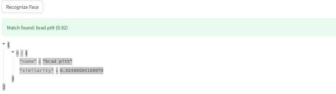
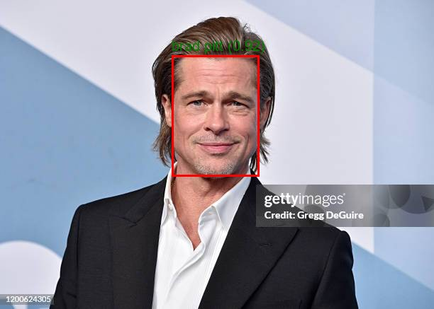
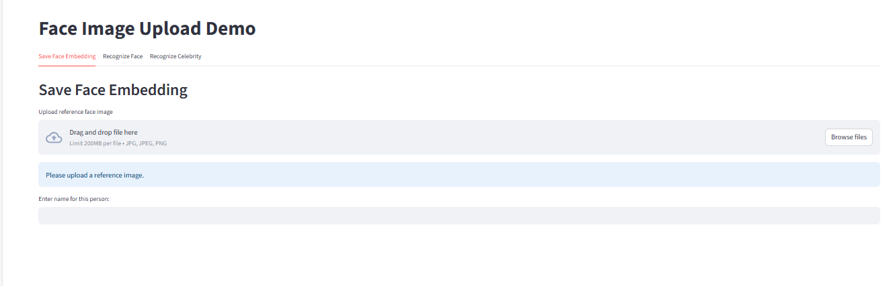
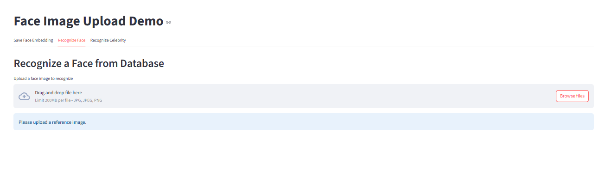
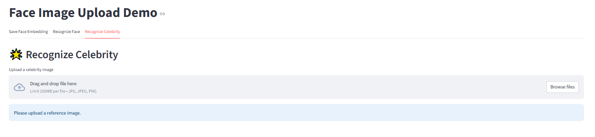

# Face Detection and Celebrity Classification using Vision Transformer and RetinaFace

## This project divede into two parts:

## Face Detection and Face Recognition:
**The first part of this project can detect human face in an image, crop and saves the detected face, and then compares it with the face found in the new image. This allows the system to decide whether the two image contain the same person. It provides fast, accurate identification based on deep-learning–powered face embeddings and similarity scoring.**

## Celebrity Classification:
**The second part of this project can detect faces in an image and predicts which celebrity the detected faces most closely resembles. **

## Features
**Detect human faces in an image: detect multiple face in an image, drawing bounding box around the face and save the coordinate using RetenaFace**
**Recognize face in an image: detect multiple face and matches it with the face that saves in the database using Vision Transformer or MTCNN**
**Predict celebrity in an image: detect multiple faces in the image and predict which clebrity is resembles mostly using Vision Transformer.**

## Samples
### Face detection


### Face recognition



### Celebrity Classification


## Dataset
### Face detection and Face Recognition
**The RetenaFace model for face detection use the wider_face dataset to train.**
**Dataset : https://drive.google.com/file/d/11UGV3nbVv1x9IC--_tK3Uxf7hA6rlbsS/view**
```
data/
└── widerface/
    ├── train/
    │   ├── images/
    │   └── label.txt
    └── val/
        ├── images/
        └── wider_val.txt
```


**wider_val.txt only includes val file names but not label information.**

### Celebrity Classification
Vision Transformer model for Celebrity Classification use Celebrity Face Image Dataset.
Dataset: https://www.kaggle.com/datasets/vishesh1412/celebrity-face-image-dataset
```
data/
│
└── celebrity_faces/
       │
       ├── Angelina_Jolie/
       │     ├── 001_fe3347c0.jpg
       │     ├── 001_fe3347c0.jpg
       │     └── ...
       ├── Brad_Pitt/
       │     └── ...
       ├── Denzel_Washington/
       │     └── ...
       ├── Hugh_Jackman/
       │     └── ...
       ├── Jennifer_Lawrence/
       │     └── ...
       ├── Johnny_Depp/
       │     └── ...
       ├── Kate_Winslet/
       │     └── ...
       ├── Leonardo_DiCaprio/
       │     └── ...
       ├── Megan_Fox/
       │     └── ...
       ├── Natalie_Portman/
       │     └── ...
       ├── Nicole_Kidman/
       │     └── ...
       ├── Robert_Downey_Jr/
       │     └── ...
       ├── Sandra_Bullock/
       │     └── ...
       ├── Scarlett_Johansson/
       │     └── ...
       ├── Tom_Cruise/
       │     └── ...
       ├── Tom_Hanks/
       │     └── ...
       └── Will_Smith/
             └── ...
```
## Tech Stack

### Backend / API
- **FastAPI** – for building the REST API and handling HTTP requests
- **Pydantic** – for data validation and request/response models

### Machine Learning / Deep Learning
- **PyTorch** – main deep learning framework  
- **Transformers (Hugging Face)** – ViT (Vision Transformer) models for image embeddings  
- **facenet-pytorch** – for face detection and recognition (InceptionResnetV1, MTCNN)  
- **scikit-learn** – for metrics like cosine similarity  

**Models / References:**  
- **RetinaFace model:** https://github.com/yakhyo/retinaface-pytorch  
- **Vision Transformer model:** https://arxiv.org/pdf/2010.11929  
- **MTCNN Embedding:** https://github.com/ipazc/mtcnn


### Image Processing
- **Pillow (PIL)** – image manipulation, drawing, and annotations  
- **torchvision** – image transforms and pretrained models (e.g., ViT)

### Data Handling / Serialization
- **NumPy** – numerical operations on arrays  
- **joblib** – model or object serialization  
- **JSON** – for structured input/output  
- **base64** – for encoding/decoding images in API responses

### Frontend / Interface
- **Streamlit** – for creating interactive frontends and dashboards

### Utilities
- **tempfile, io, os, pathlib** – file handling and temporary storage
- **subprocess** – optional command-line operations

## Installation
git clone 
cd FACE_DETECTION - COPY

## Model Performance 
### Face Detection
- **Epoch: 100/100 | Batch: 400/400 | Loss Localization : 0.5011 | Classification: 0.8221 | Landmarks: 0.7289 | LR: 0.00001000 | Time: 1.5069 s
Average batch loss: 2.5618900**

- **This is the results of the final batch in the final eppoch**

### Celebrity Classification

**Classification Report:**


    ### Celebrity Classification — Classification Report

```
                    precision    recall  f1-score   support

    Angelina Jolie     0.6667    0.5714    0.6154         7
         Brad Pitt     0.8000    0.7273    0.7619        11
 Denzel Washington     0.8571    0.7500    0.8000         8
      Hugh Jackman     0.7692    1.0000    0.8696        10
 Jennifer Lawrence     0.7500    0.8571    0.8000         7
       Johnny Depp     1.0000    1.0000    1.0000        10
      Kate Winslet     1.0000    0.9091    0.9524        11
 Leonardo DiCaprio     0.9091    0.8333    0.8696        12
         Megan Fox     0.8750    0.8235    0.8485        17
   Natalie Portman     0.5714    0.5000    0.5333         8
     Nicole Kidman     1.0000    0.9000    0.9474        10
  Robert Downey Jr     0.8750    0.6364    0.7368        11
    Sandra Bullock     0.5556    0.8333    0.6667         6
Scarlett Johansson     0.9130    0.9545    0.9333        22
        Tom Cruise     0.8750    0.9333    0.9032        15
         Tom Hanks     1.0000    1.0000    1.0000         9
        Will Smith     0.7500    1.0000    0.8571         6

          accuracy                         0.8500       180
         macro avg     0.8334    0.8370    0.8291       180
      weighted avg     0.8572    0.8500    0.8488       180
```

Confusion Matrix:


## Instruction 
- **After cloning the repo.**
Use Working directory with FACE DETECTION - COPY folder

- **Open terminal**

cd demo/back-end
uvicorn api:app --reload

- **Open another terminal**

cd demo/front-end
streamlit run app.py

## Front-end
**Choose the image that you want to detect face and save the face embedding with his/her name**


**Choose the image that you want to detect face and matches it with the face that saves in the database**


**Choose the image that you want to detect face and predict celebrities**


## References

**https://github.com/yakhyo/retinaface-pytorch**
**https://arxiv.org/pdf/2010.11929**
**https://github.com/ipazc/mtcnn**
